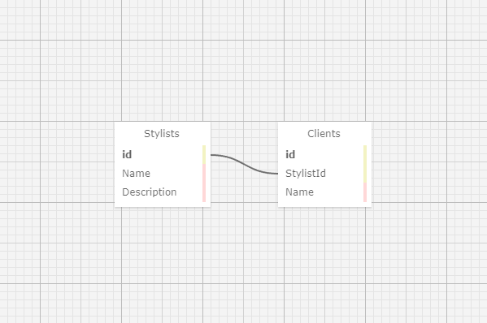

# *Eau Claire's Salon*
#### By Trent Dietzel

## Table of Contents
- [About](#about)
- [Features](#features)
- [Technologies Used](#technologies-used)
- [Installation](#installation)
- [Setting Up SQL](#setting-up-the-sql-database)
- [Contributing](#contributing)
- [Known Bugs](#known-bugs)
- [License](#license)
- [Contact](#contact)

## About
The primary functionality of the application is to manage a hair salon's stylist and client information. Users can add and view stylists along with their associated clients. 

## Features
- **Stylist Management**: Users can view a list of stylists, create new stylists, and see details of each stylist.
- **Client Management**: Users can add clients to specific stylists, view the list of clients for each stylist, and create new clients.

## Technologies Used
- **Language**: C#
- **Framework**: .NET
- **IDE**: Visual Studio
- **Package Manager**: NuGet
- **Version Control**: Git
- **Testing**: MSTest
- **Build Tool**: MSBuild
- **Database Management**: Entity Framework Core 6.0, Pomelo.EntityFrameworkCore.MySql

## Installation
Follow these steps to set up the project locally:
1. Open Git BASH [Download Link](https://gitforwindows.org/)
2. Clone the repository to your local machine:
   ```bash
   git clone https://github.com/tdietzel/*HairSalon*
   ```
3. Open the project directory:
   ```bash
   cd *HairSalon*
   ```
4. Open in a code editor like __Visual Studio Code__.
5. In the command line, run the command ``` dotnet run ``` to compile and execute the console application. Since this is a console application, you'll interact with it through text commands in your terminal.
6. Optionally, you can run ``` dotnet build ``` to compile this console app without running it.

## Setting up the SQL Database
This project uses a SQL database to store and manage data. Follow the instructions below to set up the database environment:

### Prerequisites
- Install SQL Workbench if you haven't already. You can download it from the [official website](https://www.mysql.com/products/workbench/).

### Steps to Set Up the Database
1. **Connect to MySQL Server**
   - Open SQL Workbench.
   - Click on the "+" icon in the "MySQL Connections" tab to create a new connection.
   - Enter the connection details such as hostname, port, username, and password to connect to your MySQL Server instance.

2. **Create a New Database**
   - Once connected, click on the "SQL Editor" tab.
   - Execute the following SQL command to create a new database:
     ```sql
     CREATE DATABASE YourDatabaseName;
     ```

3. **Create Tables**
   - Navigate to the project directory and locate the SQL script for creating tables `trent_dietzel.sql`.
   - Open the script in SQL Workbench.
   - Execute the script to create necessary tables in your database.

4. **Configure Connection String**
   - In the root of the HairSalon directory, create the `appsettings.json` file.
   - Update the connection string with the appropriate details and add it to that file:
     ```json
     {
       "ConnectionStrings": {
         "DefaultConnection": "Server=YourServerName;Database=YourDatabaseName;User Id=YourUsername;Password=YourPassword;"
       }
     }
     ```
     Replace `YourServerName`, `YourDatabaseName`, `YourUsername`, and `YourPassword` with your actual MySQL Server instance details.

5. **Testing Connection**
   - Build and run the project.
   - Ensure that your application can connect to the database without any errors.

### Database Schema Visualization


## Contributing
I welcome contributions to improve the project. If you'd like to contribute, please follow these guidelines:
1. Fork the project repository.
2. Create a new branch for your feature or bug fix.
3. Make your changes and test thoroughly.
4. Commit your changes with a descriptive commit message.
5. Push your branch to your forked repository.
6. Create a pull request to the main repository.

## Known Bugs
* _N/A_

## License
This project is licensed under the MIT License. See the LICENSE file for details.

## Contact
For any questions, suggestions, or inquiries, please contact **Trent Dietzel** at _dietzelbiz@outlook.com_.
